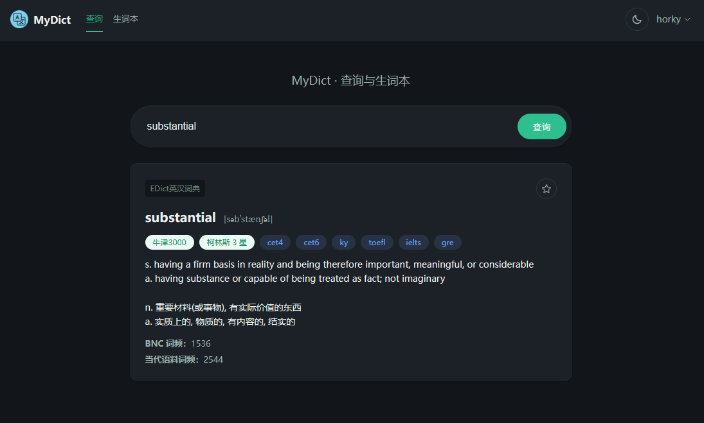
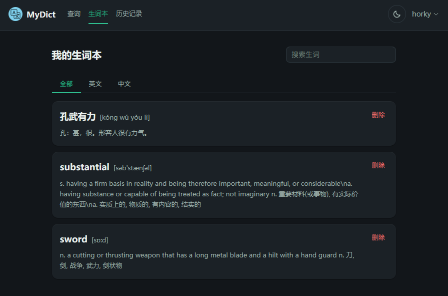
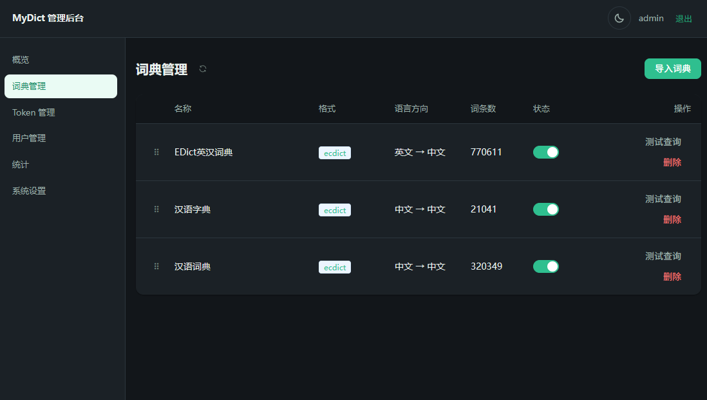

# My Dictionary Service
[](https://github.com/poxenstudio/mydict/blob/main/LICENSE)


<p align="center">
  
</p>

一个可用 Docker 一键部署的自托管词典服务：既提供带 Token 鉴权的查询/收藏 API 给第三方调用，也提供一个开箱即用的 Vue3 网页词典——查询、生词本、深浅主题都有；管理员可在后台导入 MDict/StarDict/ECDICT 三种格式的词典（含英汉、汉英、汉语单语词典），管理 Token/用户、查看用量统计、调整系统设置。

## UI

用户UI
<p align="center">
  
</p>

<p align="center">
  
</p>

后台管理UI
<p align="center">
  
</p>

## 功能特性

- **词典导入**：支持 MDict（`.mdx`+`.mdd`）、StarDict（`.ifo/.idx/.dict`）、ECDICT（CSV）三种格式；网页上传或服务器目录导入两种方式，后者适合 GB 级大文件。
- **对外 API**：`Authorization: Bearer <token>` 鉴权，查询/联想/词典列表/生词本增删查；管理员可开启「开放使用」允许匿名查询（按 IP 限流）。
- **网页词典**：标准查询体验，登录后可收藏生词、查看生词本；访客模式可配置。结果按词典分组、排序第一的默认展开，`entry://` 词条内跳转与发音链接可直接点击；左侧「检索范围」可临时只查某几部词典（或按语言快速筛选），只影响当前浏览器、不改动词典的启用状态。
- **繁简通搜**：查询词会自动展开成繁简、全角/半角等价写法后一并匹配，输入简体也能查到只收繁体的词典（反之亦然）。
- **管理后台**：Token 管理、用户管理、用量统计（按 Token/用户/日期/来源，支持 CSV 导出）、系统设置（限流阈值、开放使用开关等）。
- **安全**：词典释义渲染在隔离 iframe 里（`sandbox` 不含 `allow-same-origin`），第三方词典自带的样式与脚本既不会污染界面、也碰不到登录凭证。
- **单容器部署**：前端构建产物由后端 FastAPI 直接托管，SQLite 内置数据库，无需额外部署数据库/缓存服务。

## 推荐词典数据源

项目本身不附带任何词典数据，需要部署后自行下载并在后台导入：

| 方向 | 推荐来源 | 说明 |
|---|---|---|
| 英汉 | [skywind3000/ECDICT](https://github.com/skywind3000/ECDICT)（CC-BY-4.0） | 直接是 ECDICT 格式 CSV，后台选择「ECDICT」格式即可导入 |
| 汉英 | [CC-CEDICT](https://www.mdbg.net/chinese/dictionary?page=cc-cedict) | 社区有多种 MDict/StarDict 格式转制版本，按对应格式导入 |
| 汉语（单语） | [mapull/chinese-dictionary](https://github.com/mapull/chinese-dictionary)（MIT License） | 字/词/成语 JSON 语料，需先用仓库自带的 `scripts/chinese_dictionary_to_ecdict.py` 转换成 ECDICT 格式 CSV 再导入，用法见脚本内说明 |
| 其它 | [FreeMdict Forum](https://forum.freemdict.com/) | 大多数词典的发布和更新都在此论坛进行，是首选渠道 |
| 其它 | [MDX词典资源](https://mdx.mdict.org) | 一个MDX词典的镜像站点，可以找到不少现成的词典文件 |

## Docker 部署

```bash
# 1. 构建镜像
docker build -t poxenstudio/mydict .

# 2. 启动（数据全部持久化在宿主机 ./data 目录）
docker run -d --name mydict -p 8000:8000 -v $(pwd)/data:/data poxenstudio/mydict
```

或使用 `docker compose up -d`（等价于上面两步，配置见 `docker-compose.yml`）。

所有配置项均有合理默认值，无需任何 `.env` 文件即可直接运行。如需覆盖（如自定义限流阈值），执行 `cp .env.example .env` 后取消对应行注释修改，再启动时加上 `--env-file .env`（`docker compose` 会自动读取同目录下的 `.env`，存在则用，不存在则跳过)。

启动后访问 `http://<host>:8000` 即可。

## 用户分离
系统管理员不在用户列表中，不能进行普通用户的查询操作。

## 首次初始化

1. 访问 `http://<host>:8000/admin/setup`，设置管理员用户名密码（仅首次部署会出现该页面）。
2. 用管理员账号登录后台 → 「词典管理」导入至少一部词典 → 「启用」。
3. 如需给第三方调用方分配 API Token：「Token 管理」→「新建 Token」，创建后立即复制保存（明文只展示一次）。
4. 如需允许未登录访客直接查询：「系统设置」→ 打开「开放使用」。

## 词典导入的两种方式

- **网页上传**：后台「词典管理」→「导入词典」→「上传文件」，适合中小体积文件（可多选，如 `.mdx`+`.mdd`）。若词典在 `.mdx` 旁边还带了样式表或字体（如 `oxbw.css`、`SourceHanSerifJP-Regular.otf`），**请一并选中上传**——它们不在 `.mdd` 里，缺了会让词条以无样式渲染，图标变成原始尺寸那么大。
- **服务器目录导入**：把词典文件通过 `docker cp`（或挂载卷）放进容器的 `/data/dicts` 目录，再到「导入词典」→「从服务器目录导入」，不经过浏览器上传，适合 GB 级大文件，也适合一次放进去一整个词典库。该目录视图会**自动识别**里面的词典：按文件名把配套文件归到同一部（`.mdx`+`.mdd`，含 `.mdd` 拆成的多卷 `.1.mdd`/`.2.mdd`，以及 `.ifo`+`.idx`+`.dict` 和 `.dict.dz`/`.idx.gz` 压缩件），自动填好格式与名称（StarDict 直接取 `.ifo` 里的 `bookname`，其余优先用文件夹名——因为常见的整理方式是「一个文件夹一部词典」），标出缺文件的残缺项，然后**一次勾选、一键批量导入**。若词典是按文件夹分开放的，勾上「**包含子目录**」即可一次列出整棵目录树里的所有词典（每个分组会标出所在目录），不用逐层点进去。语言方向（如英汉 `en → zh-Hans`、汉英、汉语单语、英英）在导入时按词头与释义的文字自动识别，导入后觉得不对可在词典列表里「编辑」修正。若只想要释义、不需要真人发音和插图，勾上「**不导入发音/图片**」——MDict 把资源单独放在 `.mdd` 里，它常是词典体积的大头（实测某些词典 `.mdd` 能占到全库体积的九成），跳过它磁盘占用能降一个数量级。

```bash
docker cp ./oxford.mdx mydict:/data/dicts/
docker cp ./oxford.mdd mydict:/data/dicts/
```

## 常见问题

**忘记管理员密码怎么办？**

```bash
docker exec -it mydict python -m app.cli reset-admin-password --username admin
```

按提示输入新密码即可（不接入邮件服务，找回密码均走此命令行方式）。

**数据存在哪里，怎么备份？**

容器内 `/data` 目录（SQLite 数据库、词典文件、自动生成的 JWT 密钥、运行日志均在其中），备份/迁移只需复制该目录（如启动命令中挂载的宿主机 `./data`）。运行日志在 `/data/logs/mydict.log`，按 5MB 自动滚动、保留最近 5 份，登录成功/失败等事件也会写进去，容器内 `docker logs` 能看到同样的内容。

**升级镜像会不会丢数据？**

不会。`/data` 是独立的挂载卷，重新构建/替换镜像并用相同的 `-v` 挂载启动即可，容器启动时会自动执行数据库迁移。

升级期间打开网页会看到「正在升级数据库」的维护页，显示当前步骤与已用时，完成后页面自动刷新；这段时间里 API 调用返回 `503`（`code: maintenance`），稍后重试即可。其中**重型迁移**（会整表重建词条表）在词库较大时可能要跑几十分钟，耐心等它完成即可；它需要约与数据库文件同等大小的剩余磁盘空间，空间不足时维护页会提示。万一中途被打断（容器被重启/停止），再次启动会自动接着执行。升级前备份一下 `data/db/mydict.sqlite3` 总是稳妥的。

如果维护页提示升级失败，先用 `docker compose logs mydict` 查看原因，处理后重启容器即可继续；也可以停掉服务手动执行：

```bash
docker compose stop mydict
docker compose run --rm mydict python -m app.cli migrate          # 查看待执行的迁移与磁盘空间
docker compose run --rm mydict python -m app.cli migrate --yes    # 执行
docker compose up -d
```

**查询接口一直返回 401？**

默认「开放使用」是关闭的，查询类接口必须携带有效 Token（或以登录用户身份访问网页版）；如需允许匿名查询，去后台「系统设置」打开「开放使用」。

**导入之后可以删掉 `/data/dicts` 里的词典文件吗？**

可以。导入时释义会写进 SQLite、`.mdd` 里的图片/发音会解包到 `/data/dictionaries/<词典id>/res/`，`.mdx` 同级目录的样式表/字体也**一并复制**进了同一个 `res/`，查词只读这两处；`/data/dicts` 里的原始文件导入后不再被读取（数据库里只留了个路径字符串，用来标记文件「已导入」）。

但要注意两点：

- **删掉就无法重新导入**。数据库丢了、或以后想换个方式重导，都得重新找这些词典。删之前请务必确认另有备份。mydict **不会**自动删除你的文件，删不删、什么时候删都由你自己决定。
- **省不了整整一份空间**。`.mdd` 其实是「源文件 + 解包出的 `res/`」两份占用，导入期间峰值约等于两者之和。所以如果盘不够，建议：

  - **把放词典的 NAS/外置目录直接挂成 `/data/dicts`**（`-v /path/to/dicts:/data/dicts`）：从服务器目录导入只读不复制，源文件完全不占本机空间，本机只承担解包出来的资源；本地那份确认无误后即可删除。
  - **手动分批导入**：导入几部 → 确认无误 → 删掉这几部的源文件 → 再导下一批。占地方的大词典优先处理，否则「已累积的资源 + 当前这部的源与资源」仍可能超过可用空间。
  - 只要释义不要发音图片的话，导入时勾「不导入发音/图片」最省事，占用能降一个数量级。

**导入时报「服务器内部错误」怎么办？**

先看日志 `/data/logs/mydict.log`（容器内）里那条堆栈。目前最常见的一种是**很老的 MDict 词典**：

MDict 引擎版本低于 2.0 的词典用 LZO 压缩数据块（2.0 以后才用 zlib），而 mydict 依赖的 `mdict-utils` 只有在额外装了 `python-lzo` 时才支持 LZO。`python-lzo` 和它依赖的 `liblzo2` 都是 **GPL**，与本项目 MIT 授权不兼容，所以没有内置——日志里会看到 `RuntimeError: LZO compression is not supported`，导入界面则会显示「该词典使用了 LZO 压缩（MDict 引擎版本低于 2.0），当前构建未启用 LZO 支持」。

这类词典可以**离线转换**后再导入：仓库里的 `scripts/mdict_lzo_to_ecdict.py` 把它们导出成 ECDICT 格式 CSV，再走正常的 ECDICT 通道（该脚本是运维工具，不属于运行时代码，只有运行它才需要 GPL 的 python-lzo）：

```bash
pip install python-lzo mdict-utils
python scripts/mdict_lzo_to_ecdict.py --source "/data/dicts/某词典" --out-dir ./out
# 产出的 CSV 放到 /data/dicts 下，用「从服务器目录导入」勾选即可（会自动识别为 ECDICT）
```

只导出词条正文，`.mdd` 里的图片/发音不会带上。

**词条里的词点不动、发音点了没反应、文字图片成片丢失？**

早期版本有一处改写缺陷：`entry://`（词条内跳转）、`sound://`（发音）与 `file:///`（词典内部图片）被当成普通的相对路径，改成了指向不存在位置的链接。**修好的只是导入代码，已导入的词典不受影响**，需要跑一次修复命令：

```bash
docker exec -it mydict python -m app.cli repair-entry-links --dry-run   # 先看有多少待修
docker exec -it mydict python -m app.cli repair-entry-links --yes       # 确认后执行
docker restart mydict                                                    # 查询结果有缓存，需重启
```

顺带说明「文字图片丢失」还有第二个原因，**不需要做任何操作**：词典大多在 Windows 上打包，词条里的图片引用与 `.mdd` 里的真实文件名大小写常常不一致（例如引用 `down/30/305626w1b7f8b.gif`、文件其实叫 `down/30/305626w1b7F8B.gif`）。Windows 和 MDict 客户端不区分大小写，Linux 上就是 404——表现为词条里的文字图片整片空白。程序现在会按大小写不敏感地去找，所以升级后直接就好了。

修复是就地字符串替换、可重复执行（第二次会显示没有需要修复的），不会碰 `/data/dicts` 里的源文件。实测这一批共影响 7 部词典约 99 万行（汉典、千篇汉语词典 2021/2023、说文解字段注、大辭海、朗文 LDOCE5、新世纪日汉双解）。

**搜索时为什么有些词典的结果不出现？**

查询会按语言方向路由：先用「与输入语言一致」的词典查，**一部都没命中才**退到其他语言的词典（这时界面上会标「其他语言词典」）。语言方向是导入时按词头与释义的文字自动识别的，可能判错——早期版本只采样词典开头，而开头常是索引项或整页扫描图，实测把 6 部中文词典（含 46 万条的「汉典」）判成了 `en`，这类词典的 `lang_from` 需要重新识别：

```bash
docker exec -it mydict python -m app.cli redetect-languages --dry-run   # 先看识别结果
docker exec -it mydict python -m app.cli redetect-languages --yes
docker restart mydict
```

扫描版词典（整页是图片、没有可提取文字）判不出来，在「词典管理 → 编辑」里手工设置语言方向即可。

如果你只是想收窄本次查询的范围（比如暂时不想看到日文词典），登录后用查询页左侧的「检索范围」勾选或按语言筛选（列出的是你账号可用的词典）——那只影响你自己的浏览器，不改动词典的启用状态。

**词条里的图标特别大、表格没有边框？**

早期版本导入时只认 `.mdx`/`.mdd`，而 MDict 的样式表、字体、脚本按惯例放在 `.mdx` **同级目录**（不在 `.mdd` 里）——缺了它们，词条就以无样式渲染：图标回到原始像素（大辞泉的发音图标 75×74、岩波的派生語图标 387×150）、表格只剩文字排在一起。修好的只是导入代码，**已导入的词典需要补一次文件**（不必重新导入）：

后台「词典管理」→ 页头 **「从源文件修复」** → 几秒即可（也可先勾选只修某几部）。它会把源目录里的
`.css`/字体/图片复制进各部词典的 `res/`，可重复执行。

**词条里出现 `` `1` `` `` `2` `` 这类数字、排版错乱？**

那些是 MDict 的**样式标记**：`.mdx` 头部的 `StyleSheet` 字段定义了「编号 → 开始/结束标签」
的替换表，正文里用 `` `编号` `` 引用，本该由客户端展开成对应的 HTML。此前没处理，标记就
原样显示了。同样是「从源文件修复」那个按钮——它会读源文件里的 `StyleSheet` 把已入库的释义
就地展开，**不必重新导入**。只对「词条里真的含反引号」的词典打开 `.mdx`（打开一次要几秒到
十几秒），其余不受影响。

**扫描版词典（辞海这类）的字太小看不清？**

这类词典每个词条就是一整页扫描图（辞海的页图天然尺寸 3383×5184），按容器宽度显示后，
一页上的多栏小字自然就小得读不了。**点一下词条里的图**会弹出大图：滚轮缩放（以光标为
中心）、拖动平移，按 Esc 或点图片以外的区域退出。只有渲染尺寸够大的图才响应——正文里
那些 16px 的小图标（发音按钮、词性括号等）点了不会弹。

**Speex（`.spx`）发音能直接播吗？**

能，**不需要转码、也不需要 ffmpeg**。浏览器没有原生的 Speex 解码器，所以词条里第一次点到 `.spx` 发音时，页面会加载一个约 320KB 的 JS 解码器（之后缓存），在浏览器里解码后播放。同名的 `.mp3`/`.opus` 存在时优先直接播放它们。

点了仍提示「这条发音不存在或解码失败」：多半是资源文件本身缺失——在浏览器开发者工具的「网络」面板里看那条 `/dict-res/...` 请求是不是 404；若是，对该词典执行「词典管理 → 重新解析」即可从源文件补回缺失的资源（已有文件不会被覆盖）。

早期版本提供过服务端 ffmpeg 转码（后台「批量转码」、`scripts/transcode_spx.py`），现已移除；之前转好的 mp3 会继续被优先使用，`docker-compose.yml` 里为 ffmpeg 加的挂载可以删掉。

## License

代码以 [MIT License](./LICENSE) 开源，第三方依赖许可证清单见 [THIRD-PARTY-NOTICES.md](./THIRD-PARTY-NOTICES.md)。词典数据本身不随本仓库分发，版权与许可以各自数据源为准。
